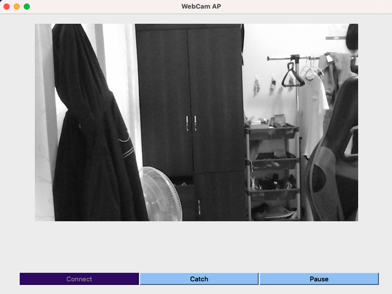
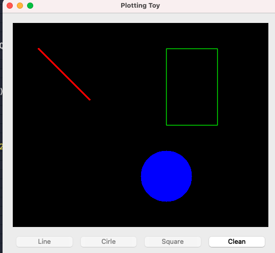
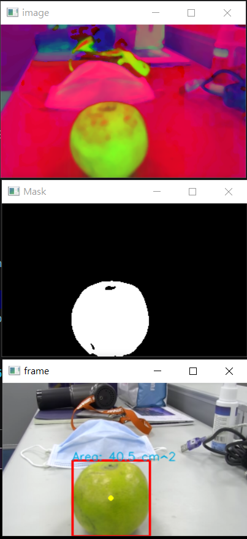
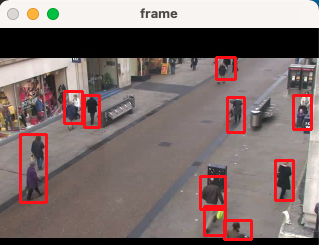
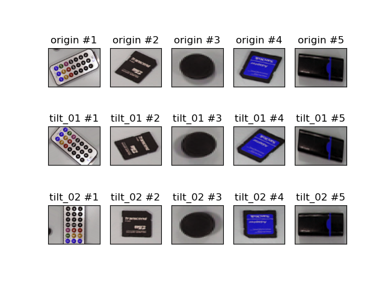
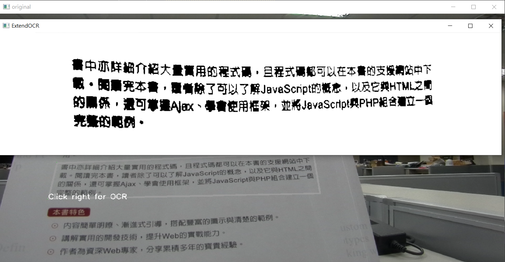
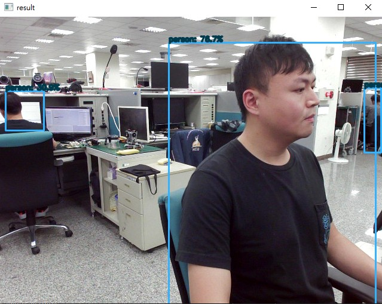

# OpenCV-Beginner
All of the AP using situation can see the 0X.png
## 01-WebCamWithQT.py
- Here use MVC structure to get camera status and UI display
- class MainWindow(QMainWindow, QObject): controll the UI and use cv2.VideoCapture(0) to connect camera
- class CameraManager(QObject): use a QTimer to update/control the frame

 
## 02-PlotToyWithQT.py
- It is a small AP to control cv2.line, cv2.rectangle and cv2.circle

## 03-BallTracking.py
- Use cv2.inRange to get a mask
- USe cv2.findContours to get the contours
- And cv2.rectangle to plot the contour

## 04-MovingTracking.py
- USe cv2.medianBlur and cv2.Laplacian to fuzzy the video
- cv2.createBackgroundSubtractorMOG2 can get the moving object
- cv2.bitwise_and can get the mask

## 05-TiltObject.py
- 取出物件，並旋轉至正面

## 06-invoiceSimpleDetect.py
- 統一發票文字識別(OCR)

## 07-OCRTranform.py
- 中文文字識別(OCR)

## 08-UsingYolo4.py
- 簡單使用YoloV4 範例
- tensorflow: 2.8.0
- opencv: 4.5.4

