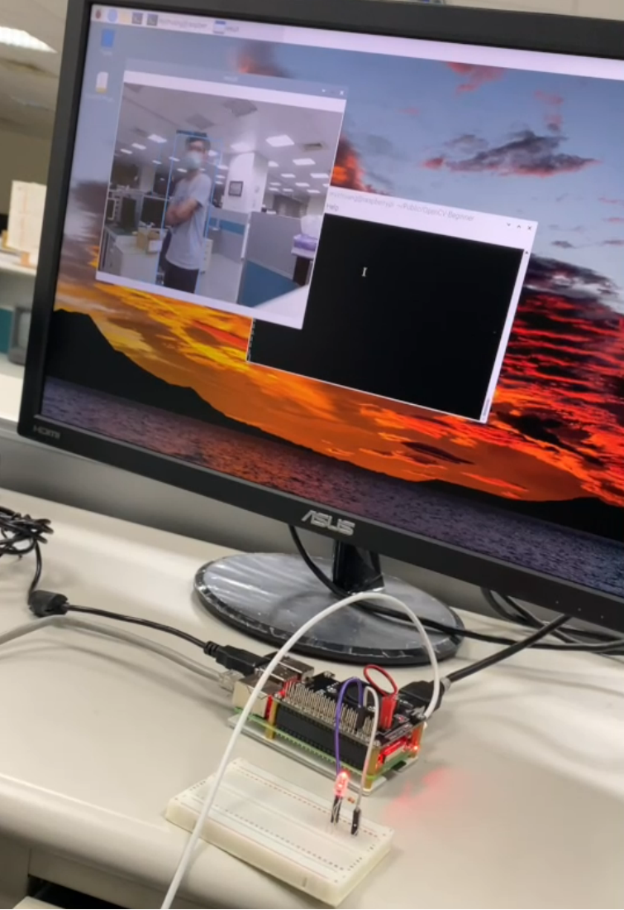

# OpenCV_Raspberry_AI
此 Repository 紀錄OpenCV, 樹梅派與AI的小型專案，相關基礎範例可以參閱BasicSample資料夾

Yolotrainning 資料夾說明採用Yolo V4訓練Kaggle口罩資料的範例

其他小專案則如以下所列
## 01-WebCamWithQT.py
- Here use MVC structure to get camera status and UI display
- class MainWindow(QMainWindow, QObject): controll the UI and use cv2.VideoCapture(0) to connect camera
- class CameraManager(QObject): use a QTimer to update/control the frame

 
## 02-PlotToyWithQT.py
- It is a small AP to control cv2.line, cv2.rectangle and cv2.circle

## 03-BallTracking.py
- Use cv2.inRange to get a mask
- USe cv2.findContours to get the contours
- And cv2.rectangle to plot the contour

## 04-MovingTracking.py
- USe cv2.medianBlur and cv2.Laplacian to fuzzy the video
- cv2.createBackgroundSubtractorMOG2 can get the moving object
- cv2.bitwise_and can get the mask

## 05-TiltObject.py
- 取出物件，並旋轉至正面

## 06-invoiceSimpleDetect.py
- 統一發票文字識別(OCR)

## 07-OCRTranform.py
- 中文文字識別(OCR)

## 08-YoloCamera.py
- yolo 搭配 ip camera，並只會出person 類別

## 09-YoloCameraLight.py
- 延續 08-YoloCamera.py，新增GPIO模組
- 偵測到人，樹梅派外接 led 燈會亮 

