# SQL 挑戰題庫
表單如下
- 學生表

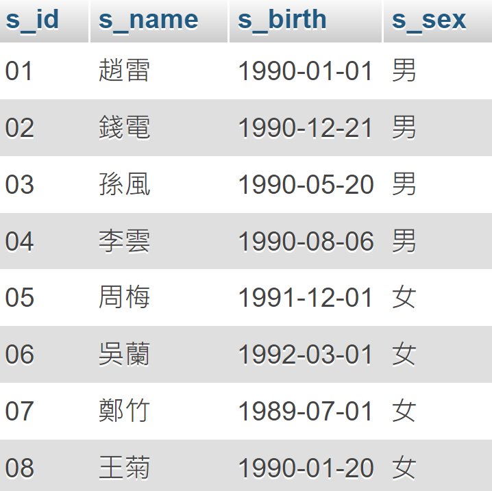 <p>

- 課程表

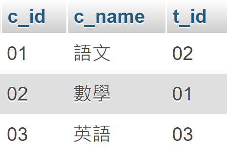 <p>

- 教師表

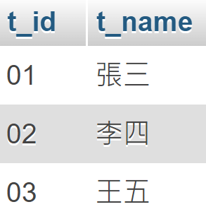 <p>

- 成績表

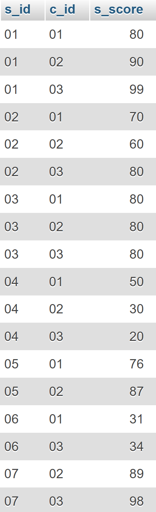 <p>

## 查詢" 01 "課程比" 02 "課程成績高的學生的資訊及課程分數
```sql
-- 1. 選取的欄位，及所在表
-- 2. 所需的信息出自不同的表，需要建立連接
-- 3. 明確所要的條件
SELECT Student.*, S1.*, S2.* FROM Student, Score S1, Score S2
WHERE S1.s_id = Student.s_id
AND S2.s_id = S1.s_id
AND S1.c_id = "01" 
AND S2.c_id = "02"
ANd S1.s_score > S2.s_score
```
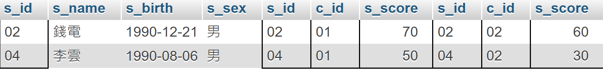

<br>

## 查詢" 01 "課程比" 02 "課程成績低的學生的資訊及課程分數
```sql
-- SELECT column and Table
SELECT Student.*, S1.s_score, S2.s_score FROM Student, Score S1, Score S2
-- Get Table Connection
WHERE S1.s_id = Student.s_id ANd S2.s_id = S1.s_id
-- Logic
AND S1.c_id = '01' AND S2.c_id = '02'
AND S1.s_score < S2.s_score
```
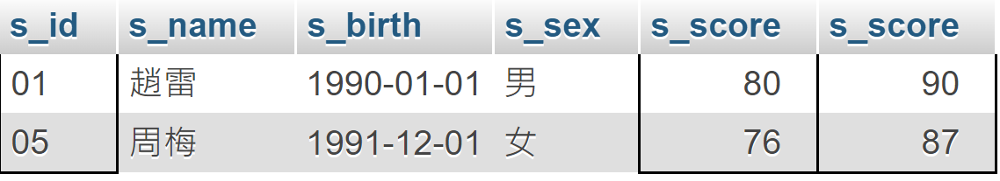

<br>

## 查詢同時存在" 01 "課程和" 02 "課程的情況
```sql
-- -- Method 1
-- SELECT column and Table
SELECT S1.*, S2.* FROM Score S1, Score S2
-- Get Table Connection
WHERE S1.s_id = S2.s_id
-- Logic
AND S1.c_id = '01' AND S2.c_id = '02';

-- -- Method 2
SELECT * FROM
-- SELECT column and Table with Logic
    (SELECT Score.* FROM Score WHERE Score.c_id = '01') AS T1,
    (SELECT Score.* FROM Score WHERE Score.c_id = '02') AS T2
-- Get Table Connection
   WHERE T1.s_id = T2.s_id;
```

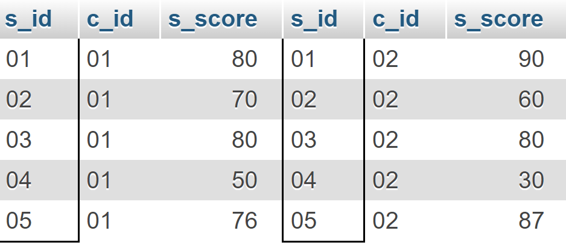

<br>

## 查詢存在 "01" 課程但可能不存在 "02"課程的情況
```sql
-- SELECT column and Table with Logic
SELECT * FROM (
    SELECT Score.* FROM Score WHERE Score.c_id = '01') AS T1
LEFT JOIN (
    SELECT Score.* FROM Score WHERE Score.c_id = '02') AS T2
-- Get Table Connection
    ON T1.s_id = T2.s_id
```

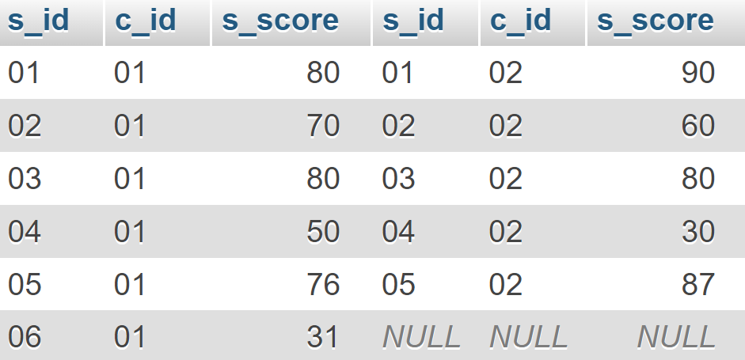

<br>

## 查詢不存在 "01"課程但存在 "02"課程的情況
```sql
-- 反查詢
SELECT * FROM Score 
WHERE Score.s_id NOT IN (
    SELECT Score.s_id FROM Score WHERE Score.c_id = '01'
) AND Score.c_id = '02'
```

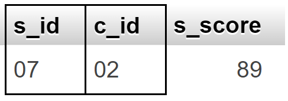

<br>

## 查詢平均成績大於等於 60 分的同學的學生編號和學生姓名和平均成績

```sql
-- 1. Select col. and table
-- 2. Connect tables
-- 3. Logic: 在group by聚合的情況下設置條件>=60，需用到having子句
SELECT Student.s_id, Student.s_name, AVG(Score.s_score) FROM Student
JOIN Score ON Student.s_id = Score.s_id
GROUP BY Score.s_id
HAVING AVG(Score.s_score) >= 60
```
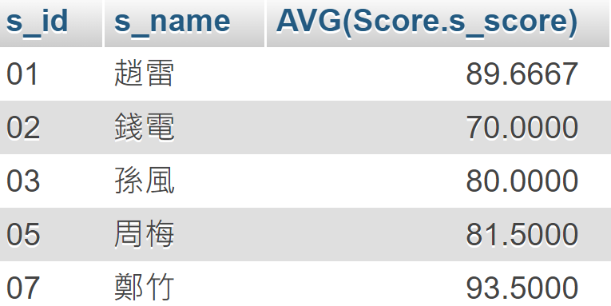 

<br>

## 查詢平均成績小於60分的同學的學生編號和學生姓名和平均成績(包括有成績的和無成績的)
```sql
-- Select col. & tables
SELECT Student.s_id, Student.s_name, AVG(Score.s_score) FROM Student
-- Connect tables
LEFT JOIN Score ON Score.s_id = Student.s_id
-- Logic
GROUP BY Student.s_id 
HAVING AVG(Score.s_score) < 60 OR AVG(Score.s_score) IS NULL
```
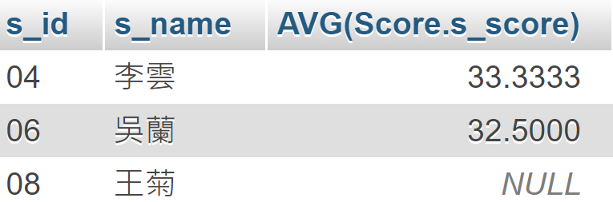 

<br>

## 查詢在成績表存在成績的學生資訊
```sql
SELECT DISTINCT Student.* FROM Student 
INNER JOIN Score ON Score.s_id = Student.s_id;

-- 小資料適用
SELECT DISTINCT Student.* from Student, Score
WHERE Student.s_id = Score.s_id;

-- 大資料適用
SELECT * from Student 
WHERE EXISTS (SELECT Score.s_id FROM Score WHERE Student.s_id = Score.s_id)

-- 小資料適用
select * from Student
WHERE Student.s_id in (SELECT Score.s_id FROM Score)
```

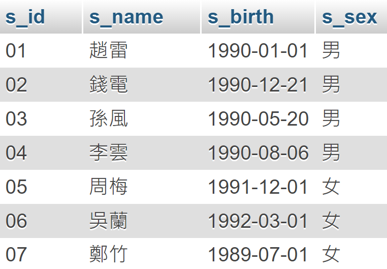 

<br>

## 查詢所有同學的學生編號、學生姓名、選課總數、所有課程的成績總和
```sql
-- Select cols. & tables
SELECT Student.s_id, Student.s_name, COUNT(Score.c_id), SUM(Score.s_score)
FROM Student
-- Connect tables
LEFT JOIN Score ON Score.s_id = Student.s_id
-- Logics: Using group by
GROUP BY Student.s_id
```

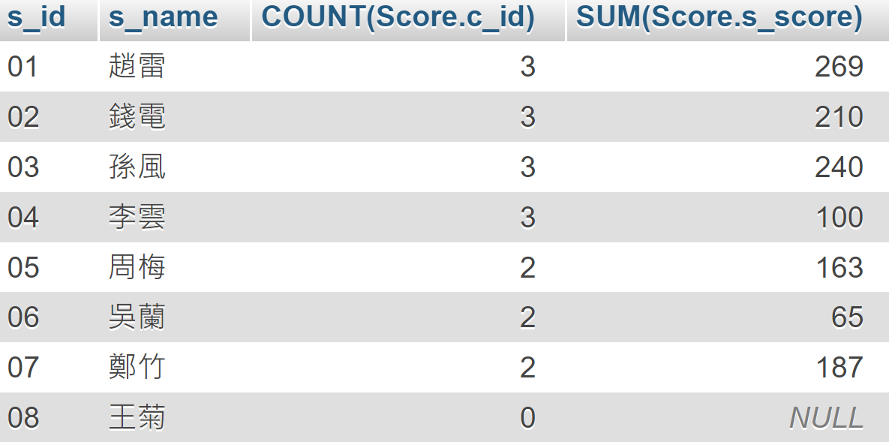

<br>

## 查詢所有同學的學生編號、學生姓名、選課總數、所有課程的成績總和(不顯示沒修課的學生)
```sql
SELECT Student.s_id, Student.s_name, COUNT(Score.c_id), SUM(Score.s_score) 
FROM Student 
INNER JOIN Score ON Score.s_id = Student.s_id 
GROUP BY Student.s_id
```

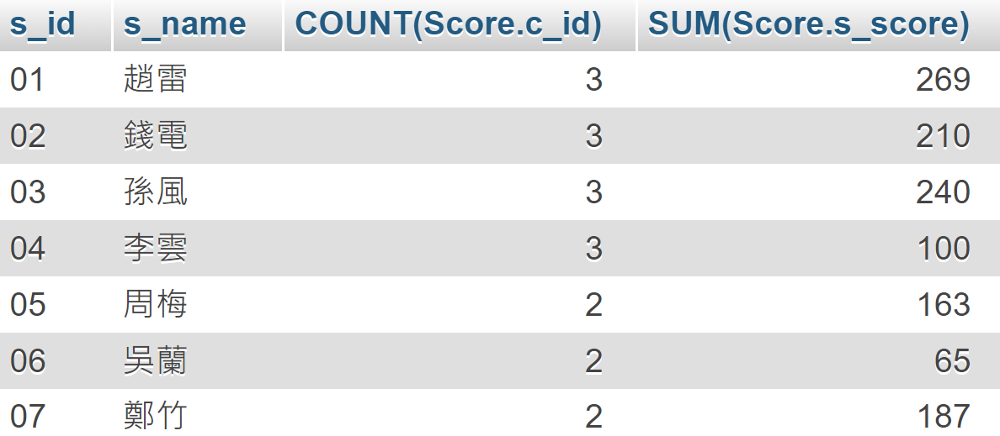

<br>

## 查詢「李」姓老師的數量
```sql
SELECT COUNT(Teacher.t_name) FROM Teacher WHERE Teacher.t_name LIKE '李%'
```

<br>

## 查詢學過「張三」老師授課的同學的資訊
```sql
SELECT Student.* FROM Student, Teacher, Score, Course
WHERE Student.s_id = Score.s_id
AND Score.c_id = Course.c_id
AND Course.t_id = Teacher.t_id
AND Teacher.t_name = '張三'
```
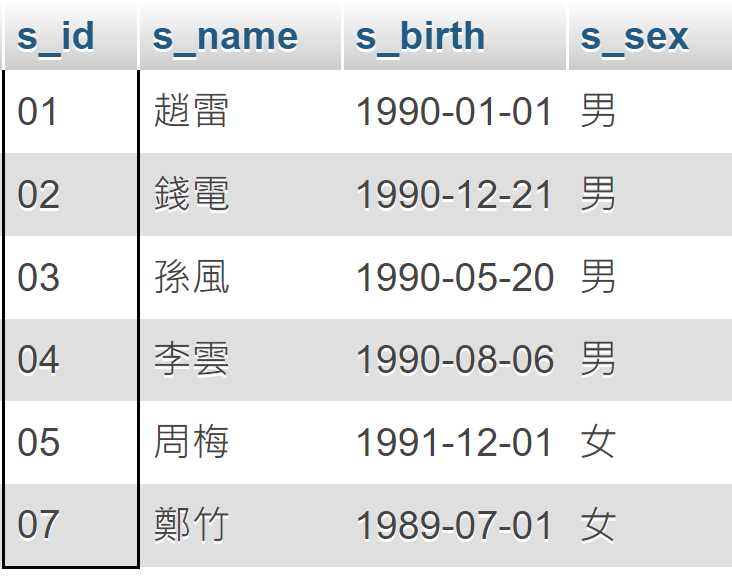

<br>

## 查詢沒有學全所有課程的同學的資訊
```sql
-- 因為有學生什麼課都沒有選，反向思考，先查詢選了所有課的學生，再選擇這些人之外的學生
SELECT Student.* FROM Student
WHERE Student.s_id NOT IN (
    SELECT Score.s_id FROM Score
    GROUP BY Score.s_id 
    HAVING COUNT(Score.c_id) = (SELECT COUNT(Course.c_id) FROM Course)
)
```

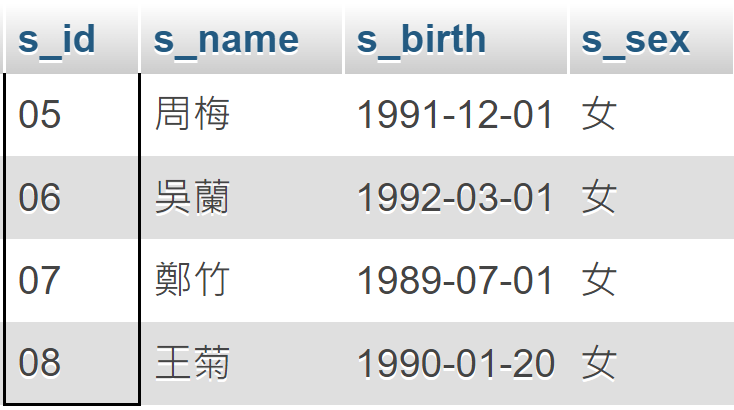

<br>

## 查詢沒學過"張三"老師講授的任一門課程的學生姓名
```sql
SELECT Student.s_name FROM Student WHERE Student.s_id NOT IN(
    SELECT Score.s_id FROM Score WHERE Score.c_id = (
        SELECT Course.c_id FROM Course WHERE Course.t_id IN (
            SELECT Teacher.t_id FROM Teacher WHERE Teacher.t_name = '張三'
        )
    )
)
```

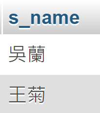

<br>

Refer: 
1. https://allaboutdataanalysis.medium.com/%E8%B6%85%E7%B6%93%E5%85%B8mysql%E7%B7%B4%E7%BF%9250%E9%A1%8C-%E5%81%9A%E5%AE%8C%E9%80%99%E4%BA%9B%E4%BD%A0%E7%9A%84sql%E5%B0%B1%E9%81%8E%E9%97%9C%E4%BA%86-600fca8979a8
2. 
