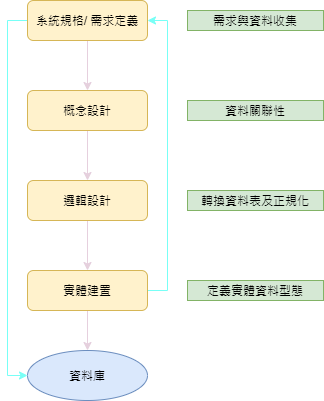
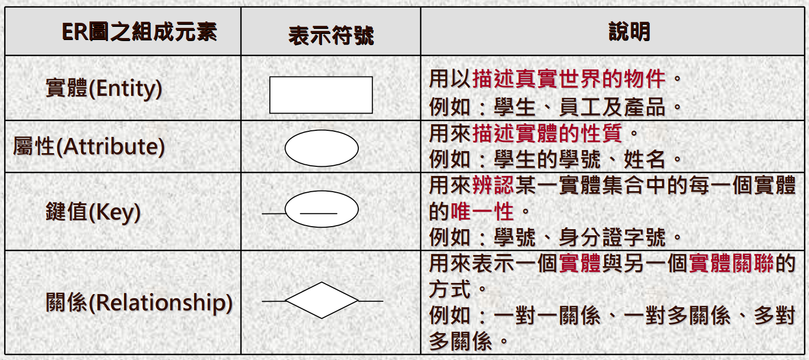
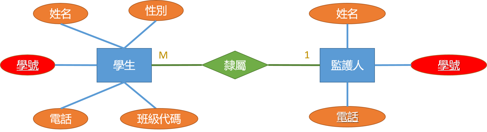
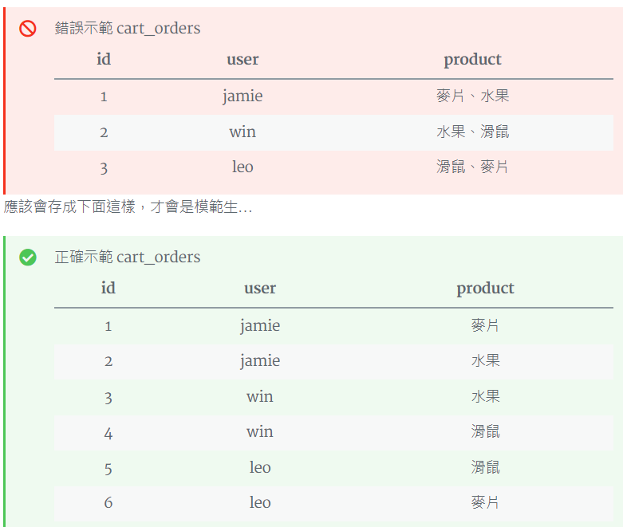
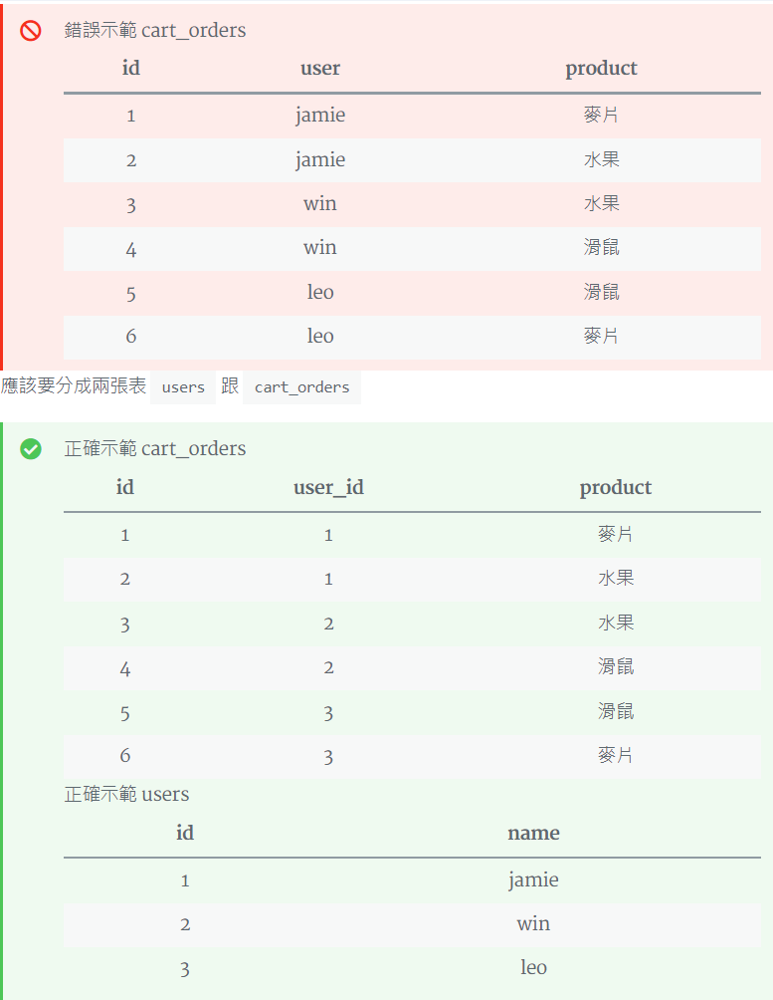
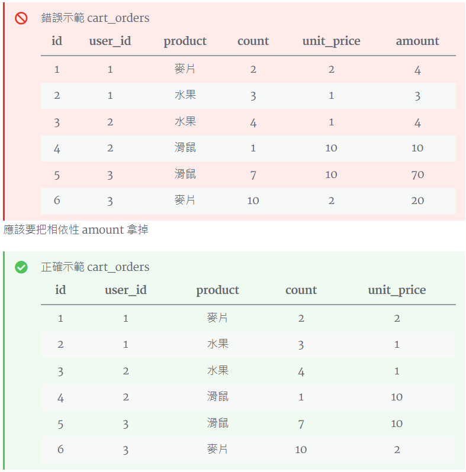

# Data Base Design Note
Refer: 
- http://www.tsnien.idv.tw/DataBase_WebBook/%E7%AC%AC%E4%B9%9D%E7%AB%A0%20%E8%B3%87%E6%96%99%E5%BA%AB%E7%9A%84%E9%82%8F%E8%BC%AF%E8%A8%AD%E8%A8%88.html
- https://jamie-life-coding.site/2021/09/database-normalization-pros-cons/

## 資料庫設計流程
目前大多採用關聯式資料庫系統，資料庫的邏輯設計方法如下圖:<br>

<br>

### Step1: 系統規格與需求定義
- **針對客戶需求，確定設計範圍**：瞭解客戶的工作流程、各部門職掌範圍、資料處理方式，以確定資料庫設計的範圍及應具備的功能。
- **收集與分析資料**：除了要明確而具體的找出客戶的需求外，還要收集他們平時使用的各類表單、報表...等等，這些都是規劃資料庫的重要參考資料。
<br>

### Step2: 概念設計
分析及整理收集到的資料，產生一個能符合使用者需求的資料庫模型。一般都用 **E-R** 模式 (實體-關係模式)的圖形來製作。
<br>

### Step3: 邏輯設計
此階段是將 E-R 圖形的設計概念，轉換為實際的資料表，並符合資料表的正規化。
<br>

### Step4: 實體建置
選定所要使用的資料庫，譬如：Access、SQL Server、MySQL、、等等，再將上述所設計的資料表建立起來即完成。
<br>

## E-R Model
『實體關係模型』(Entity-Relation (E-R) Model)是將現場實境以圖形化顯現出來的工具。標準化的 E-R 圖符號如下：



個體之間需建立關係才可以由一個個體找到另一個個體，如果有一個個體它無法和其它個體建立關係，則他就沒有存在的價值。**E-R** 模式範例如下<p>


Refer: http://cc.cust.edu.tw/~ccchen/doc/db_03.pdf

### A. 多對一關係
下圖表示學生個體與班級個體之間的關係，表示學生是屬於哪一個班級的，因此，它們之間是屬於『隸屬』關係。Keys 分別為學號與班級代碼。班級代碼為共用Key


根據實體(表單)之間的關係，可細分如下:
<br>

### B. 多對多關係
下圖表示學生同時可以修讀多門課，每一門課也可以讓多位學生選讀。另外，關係也可以附加屬性，譬如選課關係增加『分數』的屬性，其用來記錄學生修讀的分數。


<br>

### C. 一對一關係
下圖顯示1對1的關係: 假設每一位學生只有一位監護人，每一位監護人也僅隸屬一位學生。



<br>

##  邏輯設計: E-R 圖轉換為資料表
延續上圖的範例，以SQL語法，依序說明如下:
### A. 多對一關係
如果關係沒有增加屬性的話，只要分別建立學生資料表與班級資料表即可

```sql
-- 建立學生資料表
create table Student(
     s_id VARCHAR(20),
     s_name VARCHAR(20) NOT NULL DEFAULT '',
     s_sex VARCHAR(10) NOT NULL DEFAULT '',
     s_phone VARCHAR(10) NOT NULL DEFAULT '',
     class_id VARCHAR(10) NOT NULL DEFAULT '',
     PRIMARY KEY(s_id)
);

-- 建立班級資料表
create table Class(
     class_id VARCHAR(20),
     class_name VARCHAR(10) NOT NULL DEFAULT '',
     class_year VARCHAR(10) NOT NULL DEFAULT '',
     PRIMARY KEY(class_id)
);
```
<br>

### B. 多對多關係
設定每位學生可以選讀多門課，每一門課可讓學生修讀，但同一位學生、同一門課僅能選讀一次。因此，設定選課的資料表為『選課總表』，其屬性為 {學號、開課代碼、分數}，其中學號與開課代碼為複合主鍵。
```sql
create table Course(
     s_id VARCHAR(20),
     c_id VARCHAR(20),
     score VARCHAR(10) NOT NULL DEFAULT '',
     PRIMARY KEY(c_id), UNIQUE (s_Id)
);
```
<br>

### C. 一對一關係
兩個實體之間是一對一的關係，大多兩實體都使用相同屬性為主鍵，譬如學生與監護人之間是一對一的關係，兩者都採用『學號』當主鍵，其關係就不需要另外建立資料表。
```sql
create table Parent(
     s_id VARCHAR(20),
     p_name VARCHAR(20) NOT NULL DEFAULT '',
     p_phone VARCHAR(10) NOT NULL DEFAULT '',
     PRIMARY KEY(s_id)
)
```
<br>

##  邏輯設計: 正規化
正規化之目的是要檢測資料表是否符合減少重複性與避免資料更新的異常<p>
- 1NF-第一正規化: 去除重複性。**每個欄位的內容都是最小單元**，不可以再分割的。如需要再分割，則需另外再設計資料表的欄位。
  
  

- 2NF-第二正規化: 去除相依性。使用外部索引鍵，讓這些資料表產生關聯。

  

-  3NF-第三正規化: 刪除不依賴索引鍵的欄位。所有欄位都必須、且僅能與主鍵之間功能性相依，其它**欄位之間不可以有相依的特性存在**。

   

正規化優缺點:

| 優點 | 缺點 |
|  ---- | ----  |
| 降低資料的重複性 |耦合性高，牽一髮動全身| 
| 去除相依性，利用外部索引鍵，產生關聯| 查詢較慢(如 join table 到一定數量| 
| update 資料較快 |DB I/O 繁忙，因為 join 很多表| 
|  |儲存成本高| 
<p>

## 實際範例
『XX公司』對於辦理進出口商品種類非常繁複，期望建立一套系統來管理，目前對商品資料如下：
- 商品名稱：
- 單價：美金
- 單位：個、批、套、
- 產地：中國、台灣、馬來西亞、越南...
- 分類：電器、廚具、寢物、工具...
- 製造商:
- 製造商地址:
- 製造商電話:
- 製造商負責人:
<p>

根據資料庫設計流程，分述如下:

### Step1. 系統規格/需求定義
由範例給定，可至少定義兩個實體: "商品" & "製造商"


### Step2. 概念設計:  E-R實體關聯圖
實體內缺少唯一識別值，"商品"建立**商品編碼**屬性，同理， "製造商"建立**製造商編碼**屬性，再將"商品實體"內再增加一個**製造商編碼**屬性，使兩者產生關連


<br>

### Step3-1. 邏輯設計: E-R 圖轉換為資料表
```sql
-- 建立商品資料表
create table Product(
     p_id VARCHAR(20),
     m_id VARCHAR(20),
     p_class VARCHAR(10) NOT NULL DEFAULT '',
     p_name VARCHAR(10) NOT NULL DEFAULT '',
     p_cost VARCHAR(10) NOT NULL DEFAULT '',
     p_unit VARCHAR(10) NOT NULL DEFAULT '',
     p_from VARCHAR(10) NOT NULL DEFAULT '',
     PRIMARY KEY(p_id), UNIQUE (m_id)
);

-- 建立製造商資料表
create table Manu(
     m_id VARCHAR(20),
     m_name VARCHAR(10) NOT NULL DEFAULT '',
     m_user VARCHAR(10) NOT NULL DEFAULT '',
     m_phone VARCHAR(10) NOT NULL DEFAULT '',
     m_addr VARCHAR(10) NOT NULL DEFAULT '',
     PRIMARY KEY(m_id)
);
```

<br>

### Step3-2. 邏輯設計: 正規化
- 商品資料表
  - 1NF：所有欄位都是最小單元(Atomic value)： **符合**
  - 2NF：除了主鍵外，所有欄位都與主鍵相依：**符合**
  - 3NF：除了主鍵外，所有欄位之間都沒有功能性相依：**不符合**<p>
    (產地欄位與製造商編碼相依。產地與製造商地址有功能性相依 => 解法: 將產地欄位移除)

- 製造商資料表
  - 1NF：所有欄位都是最小單元(Atomic value)： **符合**
  - 2NF：除了主鍵外，所有欄位都與主鍵相依：**符合**
  - 3NF：除了主鍵外，所有欄位之間都沒有功能性相依：**符合**<p>

<br>
