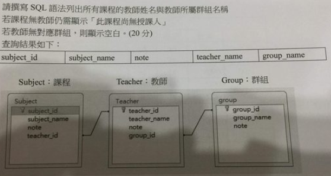
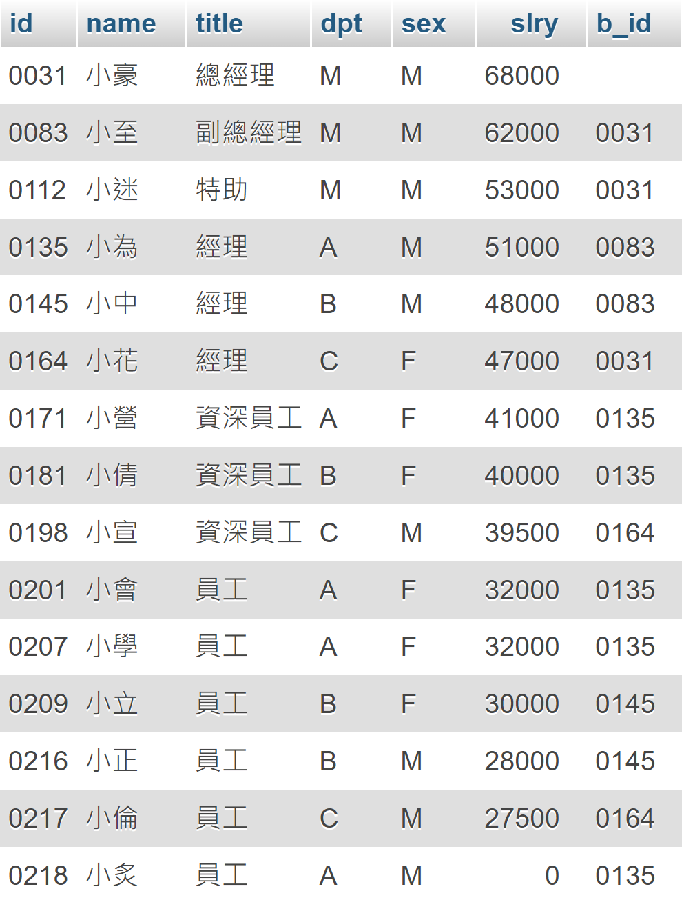

# MTA98-364 資料庫管理核心能力測驗
ANS: [MTA98-364-ANS.md](MTA98-364-ANS.md)

## 資料庫的核心概念 （10題）
1. 若要新增、移除及修改資料庫結構(CREATE, ALTER, DROP)，應該使用哪個類別的SQL陳述式？
    <ol type="A">
      <li>資料存取語言(DAL)</li>
      <li>資料控制語言(DCL)</li>
      <li>資料定義語言(DDL)</li>
      <li>資料操作語言(DML)</li>
    </ol>
<p>

2. SELECT, INSERT, DELETE,UPDATE指令屬於哪個類別的SQL陳述式
    <ol type="A">
      <li>資料存取語言(DAL)</li>
      <li>資料控制語言(DCL) GRANT, REVORK</li>
      <li>資料定義語言(DDL)</li>
      <li>資料操作語言(DML)</li>
    </ol>
<p>

3. 您需要在學校資料庫中儲存每位學生的聯絡資訊。您應該將每位學生的資訊存放在
    <ol type="A">
      <li>函式 (副程式)</li>
      <li>資料列</li>
      <li>預存程序 (資料庫裡的程式)</li>
      <li>變數</li>
    </ol>
<p>

4. 資料表中儲存單一項目資訊的元件稱為
    <ol type="A">
      <li>資料行 (欄位)</li>
      <li>資料型別 (INT, CHAR…)</li>
      <li>資料列 (紀錄)</li>
      <li>檢視</li>
    </ol>
<p>

5. 檢視可用來
    <ol type="A">
      <li>確保參考完整性
      </li>
      <li>在另一個資料表儲存額外的資料副本
      </li>
      <li>限制存取資料表中特定資料列或資料行的資料
      </li>
      <li>從基底資料表刪除歷程記錄資料之前先予以儲存
      </li>
    </ol>
<p>

6. 您有一個名為Customer的資料表。您需要加入名為District的新資料行。您應該使用哪一個陳述式
    <ol type="A">
      <li>MODIFY TABLE Customer District INTEGER
      </li>
      <li>ALTER TABLE Customer ADD District INTEGER
      </li>
      <li>MODIFY TABLE Customer ADD District INTEGER
      </li>
      <li>ALTER TABEL Customer MODIFY District INTEGER
      </li>
    </ol>
<p>

7. 以下哪個敘述可以擴充資料庫大小？
    <ol type="A">
      <li>ALTER DATABASE
      </li>
      <li>DATABASE RESIZE
      </li>
      <li>RESIZE DATABASE
      </li>
      <li>ALTER DATABASE SIZE
      </li>
    </ol>
<p>

8. 您需要從資料庫移除名為。Employee View的檢視。您應該使用哪一個陳述式
    <ol type="A">
      <li>DELETE Employee View
      </li>
      <li>DELETE VIEW Employee view
      </li>
      <li>DROP Employee View
      </li>
      <li>DROP VIEW Employee View
      </li>
    </ol>
<p>

9. 假設有一個資料庫Employee已不再需要使用。請問以下哪個預存程序可以他刪除？
    <ol type="A">
      <li>DBCC DROP DATABASE Employee
      </li>
      <li>DROP DATABASE Employee
      </li>
      <li>DELETE DATABASE Employee
      </li>
    </ol>
<p>

10. 您刪除名為Order資料表中的資料列。OrderIterm資料表中的對應資料列將被自動刪除。此程序是哪個項目的範例：
    <ol type="A">
      <li>串聯刪除
      </li>
      <li>Domino刪除
      </li>
      <li>功能性(Functional)刪除
      </li>
      <li>瀑布式(Waterfall)刪除
      </li>
    </ol>
<br>

## 建立資料庫物件（30題）
1. 您正在建立用來儲存客戶資料的資料表。AccountNumber資料行使用一律由一個字母和四位數組的值。您應該為AccountNumber資料行使用哪種資料型別？
    <ol type="A">
      <li>BYTE
      </li>
      <li>CHAR
      </li>
      <li>DOUBLE
      </li>
      <li>SMALLINT
      </li>
    </ol>
<p>

2. 您需要儲存長度為三到30個字元的產品名稱。您也需要將所使用的儲存空間縮到最小。您應該使用哪一種資料型別？
    <ol type="A">
      <li>CHAR(3,30)
      </li>
      <li>CHAR(30)
      </li>
      <li>VARCHAR(3,30)
      </li>
      <li>VARCHAR(30)
      </li>
    </ol>
<p>

3. 哪個項目定義配置給資料行值的儲存空間量？
    <ol type="A">
      <li>資料型別
      </li>
      <li>格式
      </li>
      <li>索引鍵
      </li>
      <li>驗證程式
      </li>
    </ol>
<p>

4. 需要哪兩個元素才能定義資料行？(請選擇兩個答案)
    <ol type="A">
      <li>資料型別
      </li>
      <li>索引
      </li>
      <li>索引鍵
      </li>
      <li>名稱
      </li>
    </ol>
<p>

5. 可在資料庫中執行的具名SQL陳述式群組稱為
    <ol type="A">
      <li>公式
      </li>
      <li>方法
      </li>
      <li>預存程序
      </li>
      <li>副程式
      </li>
    </ol>
<p>

6. CREATE VIEW陳述式中必須包含哪個關鍵字？
    <ol type="A">
      <li>ORDERBY
      </li>
      <li>SELECT
      </li>
      <li>UPDATE
      </li>
      <li>WHERE
      </li>
    </ol>
<p>

7. 哪個關鍵字可在CREATE TABLE陳述式中使用？
    <ol type="A">
      <li>UNIQUE
      </li>
      <li>DISTINCT
      </li>
      <li>GROUPBY
      </li>
      <li>ORDERBY
      </li>
    </ol>
<p>

8. SQL的CREATE指令可用來建立：
    <ol type="A">
      <li>DATABASE、TABLE
      </li>
      <li>PROCEDURE、TRIGGER
      </li>
      <li>INDEX、VIEW
      </li>
      <li>以上皆是
      </li>
    </ol>
<p>

9. 您建立用來儲存產品名稱的資料表。您需要以不同的語言紀錄產品名稱。您應該使用哪種資料型態?
    <ol type="A">
      <li>CHAR
      </li>
      <li>NCHAR
      </li>
      <li>TEXT
      </li>
      <li>VARCHAR
      </li>
    </ol>
<p>

10. 您需要儲存產品數量，而且您想要將所使用的儲存空間縮到最小。您應該使用哪一種資料行別？
    <ol type="A">
      <li>計數
      </li>
      <li>雙精度浮點數
      </li>
      <li>浮點數(小數)
      </li>
      <li>整數
      </li>
    </ol>
<p>

11. 您需要儲存100位學生的姓名、學號和住址。此資訊將在資料表中儲存為：
    <ol type="A">
      <li>三個項目和100個儲存格
      </li>
      <li>三個資料列和100個資料行
      </li>
      <li>100個項目和三個儲存格
      </li>
      <li>100個資料列和三個資料行
      </li>
    </ol>
<p>

12. 建立預存程序的其中一個原因是要？
    <ol type="A">
      <li>改善效能
      </li>
      <li>最小化所使用的儲存空問
      </li>
      <li>略過區分大小寫需求
      </li>
      <li>讓使用者可以控制查詢邏輯
      </li>
    </ol>
<p>

13. 您需要建立檢視以從基礎資料表篩選資料列。您必須在CREATE VIEW陳述式中，包含哪種類型的子句？
    <ol type="A">
      <li>JOIN
      </li>
      <li>FILTER
      </li>
      <li>WHERE
      </li>
      <li>CONSTRAINT
      </li>
    </ol>
<p>

14. 函式(數)和預存程序的一個差異是函式：
    <ol type="A">
      <li>必須傳回值
      </li>
      <li>無法接受參數
      </li>
      <li>無法包含交易
      </li>
      <li>必須從觸發程序呼叫
      </li>
    </ol>
<p>

15. 下列關於預存程序的敘述，哪個正確：(請選擇兩個答案)
    <ol type="A">
      <li>執行過一次後，才會被編譯
      </li>
      <li>每次執行必會建立
      </li>
      <li>(在資料庫伺服器主機裡)以存成檔案的方式來提供快速存取
      </li>
      <li>若使用者沒有具備存取該資料庫的權限，仍然可以使用執行程序的方式來變更表格中的資料列
      </li>
    </ol>
<p>

16. 下列何者不是預存程序的優點？
    <ol type="A">
      <li>可降低網路負載
      </li>
      <li>可增加資料庫的安全性
      </li>
      <li>執行速度快，可攜性佳
      </li>
      <li>可將T-SQL(M$的SQL的名字)程式模組化，提供不同使用者使用
      </li>
    </ol>
<p>

17. 資料庫的每一個表格，可以定義三種觸發機制，下列何者為非？
    <ol type="A">
      <li>INSERT
      </li>
      <li>UPDATE
      </li>
      <li>DROP
      </li>
      <li>DELETE
      </li>
    </ol>
<p>

18. 若有一個名為tri_name的觸發機制已經建立，下列哪個敘述可以刪除該觸發機制？
    <ol type="A">
      <li>DROP TRIGGER tri_name
      </li>
      <li>DROPTRIGGER tri_name
      </li>
      <li>DROP tri_name TRIGGER
      </li>
      <li>DROP('tri_name’) TRIGGER
      </li>
    </ol>
<p>

19. 下列關於觸發機制的敘述何者正確？
    <ol type="A">
      <li>觸發機制無法在表格中加強主表格與外表格之間的關係
      </li>
      <li>在含有觸發機制的表格內無法定義限制條件
      </li>
      <li>觸發機制可以在使用限制條件後執行
      </li>
      <li>觸發機制可以在使用限制條件前執行
      </li>
    </ol>
<p>

20. 下列有關觸發機制的敘述，何者為真？
    <ol type="A">
      <li>觸發機制可以刪除表格
      </li>
      <li>若表格被刪除·則定義於該表格上的觸發機制也會被刪除
      </li>
      <li>觸發機制可以改變資料庫的結構
      </li>
      <li>觸發機制不能執行流程控制的敘述
      </li>
    </ol>
<p>

21. 下列哪一個資料庫的角色可以建立與刪除觸發機制？
    <ol type="A">
      <li>表格的擁有者或是合法授權的擁有者
      </li>
      <li>僅系統管理者
      </li>
      <li>僅資料庫管理者
      </li>
      <li>僅表格的擁有者
      </li>
    </ol>
<p>

22. SQL Server提供哪些類型的資料型態？(請選擇兩個答案)
    <ol type="A">
      <li>伺服器提供
      </li>
      <li>標準
      </li>
      <li>使用者自訂
      </li>
      <li>系統提供
      </li>
    </ol>
<p>

23. 在建立使用者自訂的資料型態時，可以使用哪些屬性？
    <ol type="A">
      <li>長度、text、real、nvarchar、允許空值
      </li>
      <li>基本資料型態、長度、允許空值、預設值、規則
      </li>
      <li>char、int、nomeric、text、預設值、規則
      </li>
      <li>nchar、ntext、vnarchar、長度、允許空值
      </li>
    </ol>
<p>
 
24. 一個檢視可代表：(請選擇三個答案)
    <ol type="A">
      <li>一個或多個表格中的資料組合
      </li>
      <li>一個或多個檢視中的資料組合
      </li>
      <li>表格及檢視所組合而成的資料
      </li>
      <li>只能從一個表格來的資料
      </li>
    </ol>
<p>

25. 下列何者在檢視內不能使用？
    <ol type="A">
      <li>HAVING
      </li>
      <li>COMPUTE
      </li>
      <li>WHERE
      </li>
      <li>AVG
      </li>
    </ol>
<p>

26. CREATE VIEW 最多可使用多少個欄位？
    <ol type="A">
      <li>16
      </li>
      <li>32
      </li>
      <li>無限制
      </li>
      <li>255
      </li>
    </ol>
<p>

27. 您有一個名為Product的資料表，您建立包含Product資料表中Furniture類別目錄所有產品的檢視。您在Product資料表執行刪除Furniture類別目錄所有產品的陳述式。執行該陳述式之後，檢視的結果集會
    <ol type="A">
      <li>被封存
      </li>
      <li>被刪除
      </li>
      <li>是空的
      </li>
      <li>未變更
      </li>
    </ol>
<p>

28. 下列哪種方法可以確保表格內某個欄位的值是唯一的？
    <ol type="A">
      <li>關掉重複功能
      </li>
      <li>加入實體完整性
      </li>
      <li>加入UNIQUE限制
      </li>
      <li>加入一個具有No Duplicate性質的欄位
      </li>
    </ol>
<p> 

29. UNIQUE可限制使用者，無法輸入重複的資料欄位值，請問在一個表格中，可以定義幾個UNIQUE限制？
    <ol type="A">
      <li>只有一個 (主索引)
      </li>
      <li>2個
      </li>
      <li>一個以上
      </li>
      <li>最多16個
      </li>
    </ol>
<p>

30. 您建立用來儲存產品名稱的資料表，但出現亂碼，您應該改用哪種資料型態？
    <ol type="A">
      <li>CHAR
      </li>
      <li>NCHAR
      </li>
      <li>MEMO
      </li>
      <li>VARCHAR
      </li>
    </ol>
<br>

## 處理資料 (16題)

1. 產品資料表包含以下資料<p>

    |  ID   |  姓名 | 數量 |
    |  ---- | ----  | --- |
    | 1234  | 勺子 | 33 |
    | 2615  | 叉 | 17 |
    | 3781  | 盤子 | 20 |
    | 4598  | 杯子 | 51 |

    您執行以下聲明式：<p>
    COUNT:數 選擇計數（*）FROM Product WHERE 數量>18<p>
    這個式子傳回的值是什麼？

    <ol type="A">
      <li>1
      </li>
      <li>2
      </li>
      <li>3
      </li>
      <li>4
      </li>
    </ol>
<p>

2. 若要傳回符合特定條件的資料列，您必須在SELECT聲明式中使用哪個關鍵字？
    <ol type="A">
      <li>From
      </li>
      <li>Book
      </li>
      <li>To
      </li>
      <li>Where
      </li>
    </ol>
<p>

3. 尋找名稱包含特定元的資料時。應該在WHERE子句使用哪個關鍵字？
    <ol type="A">
      <li>Like
      </li>
      <li>Select
      </li>
      <li>Between
      </li>
      <li>Include
      </li>
    </ol>  
<p>


4. 您執行以下聲明式：

    ```sql
    Select Department From TableName Where ID = (
      Select ID From enployeeTable Where ID = 1234
    )
    ```
    此式聲明是哪個項目的翻譯
    <ol type="A">
      <li>笛卡兒
      </li>
      <li>外部聯結
      </li>
      <li>子查詢
      </li>
      <li>等位
      </li>
    </ol>  
<p>

5. 以下資料敘述可以從學生表傳回編號(id)為10或31的學生姓名
    <ol type="A">
      <li>SELECT name FROM students WHERE id> 10 AND id > 31
      </li>
      <li>S​​ELECT name FROM students WHERE id IN (10,31)
      </li>
      <li>SELECT name FROM students WHERE id=10 OR id=31
      </li>
      <li>SELECT name FROM students WHERE id=10 OR 31
      </li>
    </ol>
<p>

6. ORDERBY子句可將結果欄位使用查詢示例，最多可以查詢幾個欄位來示例？
    <ol type="A">
      <li>只有一個
      </li>
      <li>4個
      </li>
      <li>16個
      </li>
      <li>256個
      </li>
    </ol>  
<p>

7. SELECT敘述中，若包含ORDERBY子句、FROM、WHERE，ORDERBY子句如何使用？
    <ol type="A">
      <li>ORDERBY子句必須是SELECT敘述的第一個關鍵字
      </li>
      <li>ORDERBY子句必須在WHERE子句後
      </li>
      <li>)SQL Server 會依照關鍵字的英文來解釋SELECT敘述，因此關鍵字的示例並不重要
      </li>
    </ol>  
<p>

8. 以下敘述者如何計算學生表格的列數？
    <ol type="A">
      <li>SELECT ROW COUNT FROM student
      </li>
      <li>S​​ELECT Count Rows FROM student
      </li>
      <li>SELECT TOTAL ROWS FROM student
      </li>
      <li>SELECT COUNT(*) FROM student
      </li>
    </ol>  
<p>

9. 在SELECT敘述中的GROUPBY子句，可以和哪個子句組合使用？
    <ol type="A">
      <li>HAVING
      </li>
      <li>COUNTED
      </li>
      <li>COMPUTING
      </li>
    </ol>  
<p>

10. 下列何者為刪除未輸入員工電話號碼的資料列
    <ol type="A">
      <li>DELETE FROM Employee WHERE Phone IS NULL
      </li>
      <li>DELETE FROM Employee WHERE Phone = NULL
      </li>
      <li>DELETE FROM Employee WHERE Phone='&'
      </li>
      <li>DELETE FROM Employee WHERE Phone IS NOT NULL
      </li>
    </ol>  
<p>

11. 如果使用DELETE敘述時，將WHERE子句省略，會有什麼後果？ 
    <ol type="A">
      <li>由於沒有特定類型的資料列，因此不會刪除任何內容
      </li>
      <li>表格中所有的橫列被刪除
      </li>
      <li>由於WHERE子句是必須的，因此會造成錯誤
      </li>
      <li>刪除錯誤第一列，並產生
      </li>
    </ol>  
<p>

12. INSERT(UPDATE)聲明式是在哪個資料庫結構上准許？
    <ol type="A">
      <li>預存程序
      </li>
      <li>資料表
      </li>
      <li>觸發程序
      </li>
    </ol>  
<p>

13. 下面哪三個是有效的數據操作語言
    <ol type="A">
      <li> DELETE
      </li>
      <li> INSERT
      </li>
      <li> OUTPUT
      </li>
      <li> UPDATE
      </li>
    </ol>   
<p>

14. 在SQL中，INSERT聲明式是調用
    <ol type="A">
      <li>將用戶加入資料庫
      </li>
      <li>將資料表加入資料庫
      </li>
      <li>將資料列加入資料表
      </li>
      <li>將資料行加入至資料表定義
      </li>
    </ol>  
<p>

15. 以下對於SQL語言之UPDATE指令之敘述，何者為非？
    <ol type="A">
      <li> 一次只能修改一個欄位值
      </li>
      <li>一次只能修改一個資料表
      </li>
      <li>可以加入WHERE條件式來過濾要更新的資料
      </li>
    </ol>  
<p>

16. 以下哪個關鍵字可以避免在查詢的結果的欄位值中，沒有重複
    <ol type="A">
      <li>UNIQUE
      </li>
      <li>DISTINCT
      </li>
      <li>DIFFERENT
      </li>
      <li>ONLY
      </li>
    </ol>  
<br>

## 資料儲存方式 (20題)

1. 您有一個包含以下資料的資料表
    |  產品名稱   | 顏色1 | 顏色2 | 顏色3 |
    |  ----      | ----  | ---   |----  |
    | 襯衫 |       藍色的 | 綠 | 紫色的|<p>
    
    您的資料表為以下資料表:

    | 產品編號 | 產品名稱 |
    |  ---- | ----  |
    | 4545 |襯衫 | <p>

    | 產品編號 | 顏色 |
    |  ---- | ----  |
    | 4545 |藍色的| 
    | 4545 |綠| 
    | 4545 |紫色的| <p>

    此程序名稱:

    <ol type="A">
      <li>重組
      </li>
      <li>反正規化
      </li>
      <li>可分配
      </li>
      <li>正規化
      </li>
    </ol> 
<p>

2. 第一個正規化形式要求資料庫必須解決
    <ol type="A">
      <li>複合索引鍵
      </li>
      <li>重複的資料列
      </li>
      <li>索引外部鍵
      </li>
      <li>重複的一組(同樣意義的欄位)
      </li>
    </ol> 
<p>

3. 以下關於主鍵與外來鍵的敘述是什麼？
    <ol type="A">
      <li>主鍵不能有空值
      </li>
      <li>每個非空值的外來鍵應該有一個主鍵
      </li>
      <li>主鍵必須是分數(學號f10008001有f就變成文字)
      </li>
      <li>外鍵不能有空值
      </li>
    </ol> 
<p>

4. 加入索引的原因之一是
    <ol type="A">
      <li>減少所使用的儲存空間
      </li>
      <li>增加資料庫的安全性
      </li>
      <li>提高INSERT聲明式的功效
      </li>
      <li>改善SELECT聲明式的功效
      </li>
    </ol> 
<p>

5. 如果題目要移除外部索引鍵，應該使用哪個陳述式？
    <ol type="A">
      <li>ALTER TABLE DELETE FOREINGKEY
      </li>
      <li>DELETE TABLE 
      </li>
      <li>ALTER TABLE
      </li>
      <li>DELETE TABLE FOREINGKEY
      </li>
    </ol> 
<p>

6. 索引哪個鍵可以唯一識別資料表中的資料列？
    <ol type="A">
      <li>外部索引鍵
      </li>
      <li>本機索引鍵
      </li>
      <li>主索引鍵
      </li>
      <li>超級索引鍵(superKey)
      </li>
    </ol> 
<p>

7. 哪個條件約束可確保每個客戶ID資料行的值都是唯一的？
    <ol type="A">
      <li>DISTINCT
      </li>
      <li>外部索引鍵
      </li>
      <li>主索引鍵
      </li>
      <li>SEQUENTIAL
      </li>
    </ol> 
<p>

8. 哪個陳述式會建立複合索引鍵？
    <ol type="A">
      <li>CREATE TABLE Order(OrderID INTEGER, OrderltemlD INTEGER, PRIMARYKEY (OrderID, OrderltemID))
      </li>
      <li>CREATE TABLE Order(OrderID INTEGER PRIMARYKEY, Orderltem ID INTEGER PRIMARYKEY)
      </li>
      <li>CREATETABLE Order(OrderID INTEGER, OrderltemID INTEGER, PRIMARYKEY)
      </li>
      <li>)CREATE TABLE Order(OrderID INTEGER, OrderltemID INTEGER, PRIMARYKEY OrderID, PRIMARYKEY OrderltemID)
      </li>
    </ol> 
<p>

9. 哪個類型的索引會變更資料在資料表中的儲存順序？
    <ol type="A">
      <li>叢集索引
      </li>
      <li>非叢集索引
      </li>
      <li>非循序索引
      </li>
      <li>循序索引
      </li>
    </ol> 
<p>

10. 您在包含資料的資料表上建立索引。資料庫中的結果是什麼？
    <ol type="A">
      <li>會有更多資料列加入至該被索引的資料表
      </li>
      <li>會有更多資料行加入至該被索引的資料表
      </li>
      <li>會建立個別的結構，其中包含來自該被索引資料表的資料
      </li>
      <li>會建立個別的結構(另外做一個已經排序的清單)，其中不包含來自該被索引資料表的資料
      </li>
    </ol> 
<p>

11. 請問一個表格最多可以建立多少個叢集索引?
    <ol type="A">
      <li>16個
      </li>
      <li>1個
      </li>
      <li>沒有限制
      </li>
      <li>表格中每個欄位最多可以建立一個
      </li>
    </ol> 
<p>

12. 假設有一個不常更新的表格(資料大約20000筆)，但經常被使用其中兩個欄位的組合來搜尋資料，請問下列何種索引可以提高此表格的查詢速率？
    <ol type="A">
      <li>一個非叢集索引
      </li>
      <li>一個複合的非叢集索引
      </li>
      <li>一個叢集的複合索引
      </li>
      <li>一個唯一的複合索引
      </li>
    </ol> 
<p>

13. 下列敘述何者可以在student表格上建立一個複合索引:
    <ol type="A">
      <li>CREATE INDEX ind_name ON student
      </li>
      <li>CREATE INDEX ind_name ON student(first_name,last_name)
      </li>
      <li>CREATE INDEX ind_name ON student = first_name, last_name
      </li>
      <li>CREATE INDEX ind_name ON student.first_name, last_name
      </li>
    </ol> 
<p>

14. 您有Customer資料表和Order資料表。您使用Customery資料行將Customer資料表與Order資料表聯結。結果包括:所有客戶與其訂單 & 沒有訂單客戶。這些結果代表哪種類型的聯結？
    <ol type="A">
      <li>完整聯結
      </li>
      <li>內部聯結
      </li>
      <li>外部聯結
      </li>
      <li>部分聯結
      </li>
    </ol> 
<p>

15. 您有一個名為Product的資料表，它包含一百萬個資料列。您需要使用產品的唯一識別碼在Product資料表中搜尋產品資訊。什麼可讓此類型的搜尋更有效率？
    <ol type="A">
      <li>索引
      </li>
      <li>觸發程序
      </li>
      <li>子查詢
      </li>
      <li>資料指標
      </li>
    </ol> 
<p>

16. 若要移除外部索引鍵，應該使用哪個陳述式
    <ol type="A">
      <li>ALTER TABLE remove key
      </li>
      <li>DELETE TABLE
      </li>
      <li>ALTER FROMKEY
      </li>
      <li>DELETE FROMKEY
      </li>
    </ol> 
<p>

17. 執行反正規化的目的是要
    <ol type="A">
      <li>減少冗餘
      </li>
      <li>建立較小的資料表
      </li>
      <li>消除重複的群組
      </li>
      <li>改善查詢效能
      </li>
    </ol> 
<p>

18. 假設有兩個資料表，每個資料表都有三個資料列。表的Cartesian product會包含多少資料列？
    <ol type="A">
      <li>0
      </li>
      <li>3
      </li>
      <li>6
      </li>
      <li>9
      </li>
    </ol> 
<p>

19. 執行下列陳述式：
    ```sql
    SELECT EmployeeID, FirstName, DepartmentName FROM Employee,Department
    ```
    此類型的作業系統稱為
    <ol type="A">
      <li> Cartesian product
      </li>
      <li> INNER JOIN
      </li>
      <li> INTERSECT
      </li>
      <li> LEFT JOIN
      </li>
    </ol> 
<p>

20. 下列資料的資料表。
    | ProductID | ProductCategry |
    |  ---- | ----  |
    | 32 |Books| 
    | 25 |Books| 
    | 6 |movies| 
    | 89 |movies| 
    <p>
    哪一個資料庫詞彙用來描述ProductID和ProductCategry的關係？
    <ol type="A">
      <li>關聯性相依
      </li>
      <li>複合式(compositional)
      </li>
      <li>決定性(deterministiC)
      </li>
      <li>功能上相依
      </li>
      <li>關聯性相依
      </li>
    </ol> 

<br>

## 管理資料庫（10題）
1. 一組包含WITH GRANT OPTION的權限指派給User1。WITH GRANT OPTION 可讓User1:
    <ol type="A">
      <li>建立新的資料庫使用者
      </li>
      <li>委派權限給其他使用者
      </li>
      <li>要求權限使用記錄
      </li>
      <li>檢視其他使用者的權限
      </li>
    </ol> 
<p>

2. 下列哪一個資料庫詞彙用來描述套用備份到損壞或損毀資料庫的程序?(哪個資料庫詞彙描述套用備份的程序?)
    <ol type="A">
      <li>對加
      </li>
      <li>認可
      </li>
      <li>復原
      </li>
      <li>還原
      </li>
    </ol> 
<p>

3. 您在下午3:00(15:00時)建立資料庫的備份。您在下午4:00(16:00時)建立名為Customer，的資料表，並將資料匯入至該資料表。伺服器在下午5:00(17:00時)失效。
您執行指令碼，只將下午3:00的備份套用至資料庫。執行此指令碼的結果是什麼？
    <ol type="A">
      <li>指令碼失敗
      </li>
      <li>Customer資料表不受影響
      </li>
      <li>Customer資料表不再存在
      </li>
      <li>Customer資料表存在，但沒有資料
      </li>
    </ol> 
<p>

4. 您在交易中執行會從資料表刪除100個資料列的陳述式。僅刪除40個資料列之後，交易(異動)就失敗了，資料庫中的結果是什麼？
    <ol type="A">
      <li>資料表會損毀
      </li>
      <li>交易會重新敔動
      </li>
      <li>不會從資料表刪除任何資料列 (資料庫會自動復原)
      </li>
      <li>會從資料表刪除四十(40)個資料列
      </li>
    </ol> 
<p>

5. 您有一個包含10TB資料的資料庫。您需要每隔兩小時備份該資料庫。您應該使用哪種類型的備份？
    <ol type="A">
      <li>封存
      </li>
      <li>完整
      </li>
      <li>增量 
      </li>
      <li>部分
      </li>
    </ol> 
<p>

6. 您需要建立一組經常為新使用者指派的權限。您應該建立什麼？
    <ol type="A">
      <li>群族
      </li>
      <li>清單
      </li>
      <li>資源
      </li>
      <li>角色 (職務)
      </li>
    </ol> 
<p>

7. 您需要停用User1對於Customer資料表資料的檢視權限。您應該使用哪個陳述式?
    <ol type="A">
      <li>REMOVE User1 FROM Customer
      </li>
      <li>REVOKE User1 FROM Customer
      </li>
      <li>REMOVE SELECTON Customer FROM User1
      </li>
      <li>REVOKE SELECT ON Customer FROM User1
      </li>
    </ol> 
<p>

8. 您需要讓新員工向您的資料庫驗證其身分。您應該使用哪個命令？
    <ol type="A">
      <li>ADD USER
      </li>
      <li>ALLOW USER
      </li>
      <li>ALTER USER
      </li>
      <li>CREATE USER
      </li>
      <li>INSERTUSER
      </li>
    </ol> 
<p>

9. 哪一個執行敘述可以將目前的資料庫Dba換到資料庫Db_b?
    <ol type="A">
      <li>EXECUTE Db_b
      </li>
      <li>EXECUTE('USE Db_b')
      </li>
      <li>EXECUTE 'USE Db_b'
      </li>
      <li>EXEC(USE 'Db_b')
      </li>
    </ol> 
<p>

10. 發生哪種情況時需要在資料庫上執行還原：
    <ol type="A">
      <li>當您需要回復交易時
      </li>
      <li>當資料庫中的資料損毀時
      </li>
      <li>當應用程式發生錯誤時
      </li>
      <li>當必須從資料庫刪除資料時
      </li>
    </ol> 

<br>

## 概念與指令介紹實作簡例（10題）
1. 資料庫中的資料儲存在：
    <ol type="A">
      <li>資料表
      </li>
      <li>查詢
      </li>
      <li>預存程序
      </li>
    </ol> 
<p>

2. 您正在撰寫SQL陳述式來從資料表擷取資料列，您應該使用哪個資料操作語言(DML)命令？
    <ol type="A">
      <li>GET
      </li>
      <li>READ
      </li>
      <li>SELECT
      </li>
      <li>OUTPUT
      </li>
    </ol> 
<p>

3. 假設有一個資料庫Employee已不再需要使用，並想將該資料庫刪除。請問以下哪個預存程序可以他刪除？
    <ol type="A">
      <li>DBCC DROP DATABASE Employee
      </li>
      <li>DROP DATABASE Employee
      </li>
      <li>DELETE DATABASE Employee
      </li>
    </ol>  
<p>

4. INSERT陳述式是在哪個資料庫結構上運作？
    <ol type="A">
      <li>角色
      </li>
      <li>預存程序
      </li>
      <li>資料表
      </li>
      <li>觸發程序
      </li>
    </ol> 
<p>

5. UPDATE陳述式和DELETE陳述式的一個差別是什麼？
    <ol type="A">
      <li>UPDATE陳述式不會從資料表移除資料列
      </li>
      <li>UPDATE陳述式只能變更一個資料列
      </li>
      <li>DELETE陳述式無法使用WHERE子句
      </li>
      <li>DELETE陳述式只能在預存程序中運作
      </li>
    </ol> 
<p>

6. 若要將資料行(欄位)加入至現有的資料表，應該使用哪個命令？
    <ol type="A">
      <li>ALTER
      </li>
      <li>CHANGE
      </li>
      <li>MODIFY
      </li>
      <li>UPDATE
      </li>
    </ol> 
<p>

7. 您需要在Product資料表中插入兩個新產品。第一個產品命名為Book,識別碼為125。第二個產品命名為Movie，識別碼為126。您應該使用哪一個陳述式？
    <ol type="A">
      <li>INSERT NEWID=125 AND 126, Name='Book' AND 'Movie' INTO Product
      </li>
      <li>INSERT INTO Product VALUES(ID = 125, 126) (Name = 'Book', 'Movie')
      </li>
      <li>INSERT NEWID = 125, Name='Book' INTO Product; INSERT NEWID = 126, Name = 'Movie' INTO Product
      </li>
      <li>INSERT INTO Product(ID, Name) VALUES(125, 'Book'); INSERT INTO Product(ID, Name) VALUES(126, ' Movie')
      </li>
    </ol> 
<p>

8. 使用者需要哪個權限才能執行預存程序？
    <ol type="A">
      <li>ALLOW
      </li>
      <li>CALL
      </li>
      <li>EXECUTE
      </li>
      <li>RUN
      </li>
    </ol> 

9. 若要將資料表從資料庫移除，應該使用哪個命令？
    <ol type="A">
      <li>DELETE TABLE
      </li>
      <li>DROP TABLE
      </li>
      <li>EMOVE TABEL
      </li>
      <li>UPDATE TABEL
      </li>
    </ol> 

10. 若要將讀取資料表資料的權限授與使用者，應該使用哪個命令？
    <ol type="A">
      <li>ALLOW SELECT
      </li>
      <li>GRANT SELECT
      </li>
      <li>LET READ
      </li>
      <li>PERMIT READ
      </li>
    </ol> 
<br>

## SQL 綜合考題
1. 

  

2. 存在下表

  

  <ol type="A">
  <li>列出所有主管姓名</li>

  | id  | name | title | sex | slry | bossName |
  | ----| ---- | ----  | ----| ---- | ----     |


  <li>列出各部門薪資總和，並依總和高低排名</li>

  | dpt  | sumSlry | rank | 
  | ----| ---- | ----  | 

  <li>列出薪資不足50000的員工</li>

  | name  | title | slry | 
  | ----| ---- | ----  | 

  </ol>
  


Refer:
- https://sites.google.com/site/kaotitimudaan/
- https://www.ptt.cc/bbs/Database/M.1600784726.A.11B.html

