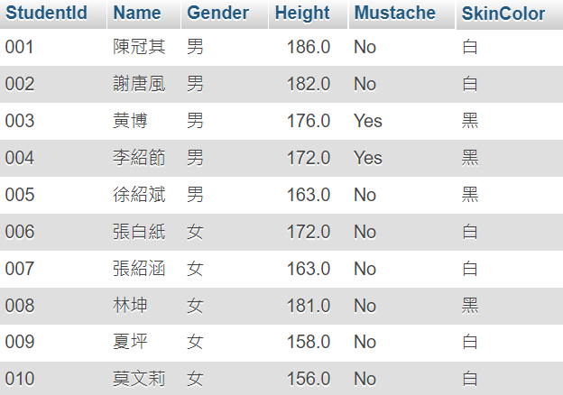
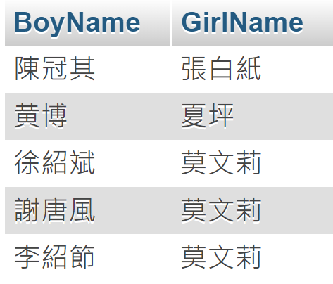
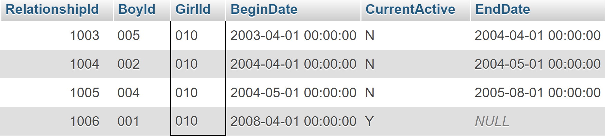

# SQL Beginner
Refer: https://allaboutdataanalysis.medium.com/%E9%9B%B6%E5%9F%BA%E7%A4%8E-sql-%E8%B3%87%E6%96%99%E5%BA%AB%E5%B0%8F%E7%99%BD-%E5%BE%9E%E5%85%A5%E9%96%80%E5%88%B0%E7%B2%BE%E9%80%9A%E7%9A%84%E5%AD%B8%E7%BF%92%E8%B7%AF%E7%B7%9A%E8%88%87%E6%9B%B8%E5%96%AE-d9918e64389f
<p>

## 創建資料庫與表單

### CREATE

```sql
-- 建立資料庫
CREATE DATABASE Beginner;

-- 建立學生表單
-- 學號, 姓名, 性別, 身高, 鬍子, 膚色
CREATE TABLE Beginner.Students(
    StudentId Varchar(10),
    Name varchar(200),
    Gender varchar(1),
    Height Numeric(4,1),
    Mustache Varchar(3),
    SkinColor varchar(1),
    PRIMARY KEY(StudentId)
);

-- 建立學生關係表單
-- 編號, 男生學號, 女生學號, 關係日期, 交往狀態, 分手日期
Create Table Beginner.Relationships(
    RelationshipId Int,
    BoyId Varchar(10),
    GirlId Varchar(10),
    BeginDate Datetime,
    CurrentActive Varchar(1),
    EndDate Datetime,
    PRIMARY KEY(RelationshipId)
);
```
<br>

### INSERT

```sql
INSERT INTO Students(
    StudentId,
    Name,
    Gender,
    Height,
    Mustache,
    SkinColor
) VALUES
-- 學號, 姓名, 性別, 身高, 鬍子, 膚色
  ('001', N'陳冠其', N'男', 186, 'No', N'白'),
  ('002', N'謝唐風', N'男', 182, 'No', N'白'),
  ('003', N'黄博', N'男', 176, 'Yes', N'黑'),
  ('004', N'李紹節', N'男', 172, 'Yes', N'黑'),
  ('005', N'徐紹斌', N'男', 163, 'No', N'黑'),
  ('006', N'張白紙', N'女', 172, 'No', N'白'),
  ('007', N'張紹涵', N'女', 163, 'No', N'白'),
  ('008', N'林坤', N'女', 181, 'No', N'黑'),
  ('009', N'夏坪', N'女', 158, 'No', N'白'),
  ('010', N'莫文莉', N'女', 156, 'No', N'白')
```

 <p>

```sql
INSERT INTO Relationships(
    RelationshipId,
    BoyId,
    GirlId,
    BeginDate,
    CurrentActive,
    EndDate
) VALUES
-- 編號, 男生學號, 女生學號, 關係日期, 交往狀態, 分手日期
  (1001, '001', '006', '2002-04-01', 'Y', null),
  (1002, '003', '009', '2001-04-01', 'Y', null),
  (1003, '005', '010', '2003-04-01', 'N', '2004-04-01'),
  (1004, '002', '010', '2004-04-01', 'N', '2004-05-01'),
  (1005, '004', '010', '2004-05-01', 'N', '2005-08-01')
```

 <p>

<br>

## 處理資料

### 查詢身高大於180cm的男同學

```sql
SELECT Students.* FROM Students 
WHERE Students.Height > 180 AND Students.Gender = '男'; 
```
<br> 

### 查詢身高大於170cm的膚白女同學

```sql
SELECT Students.* FROM Students 
WHERE Students.Height > 170 AND Students.Gender = '女'; 
```
<br>

### 查詢最高的女同學

```sql
SELECT Students.* FROM Students 
WHERE Students.Height IN (
    SELECT MAX(Students.Height) FROM Students 
    WHERE Students.Gender = "女"
) 
```
<br>

### 查詢有戀愛關係的同學

```sql
SELECT S01.Name AS Boy, S02.Name AS Girl FROM Relationships
INNER JOIN Students S01 on Relationships.BoyId = S01.StudentId
INNER JOIN Students S02 on Relationships.GirlId = S02.StudentId;
```


<br>

### 更新"陳冠其"的鬍子狀態

```sql
UPDATE Students SET Mustache = 'Yes' WHERE Name = '陳冠其'
```
<br>


### 更新'陳冠其' 與 '張白紙'關係狀態

```sql
UPDATE Relationships SET CurrentActive = 'N', EndDate = '2008-04-01'
WHERE BoyId = (
    SELECT Students.StudentId FROM Students WHERE Students.Name = '陳冠其'
)
AND GirlId = (
    SELECT Students.StudentId FROM Students WHERE Students.Name = '張白紙'
)

```
<br>

### 刪除 與'張白紙'有關係的資料

```sql
DELETE FROM Relationships WHERE GirlId = (
    SELECT Students.StudentId FROM Students
    WHERE Students.Name = '張白紙'
)
```
<br>

### 刪除 '張白紙'

```sql
DELETE FROM Students WHERE Name = '張白紙'
```
<br>


### 新增 '陳冠其' 與 '莫文莉'關係狀態

```sql
INSERT INTO Relationships(
    RelationshipId,
    BoyId,
    GirlId,
    BeginDate,
    CurrentActive,
    EndDate
) Values (1006, '001', '010', '2008-04-01', 'Y', null)
```
<br>

### 查詢'莫文莉'的關係歷史

```sql
SELECT Relationships.* FROM Relationships WHERE Relationships.GirlId = (
    SELECT Students.StudentId FROM Students
    WHERE Students.Name = '莫文莉'
)
```


<br>

