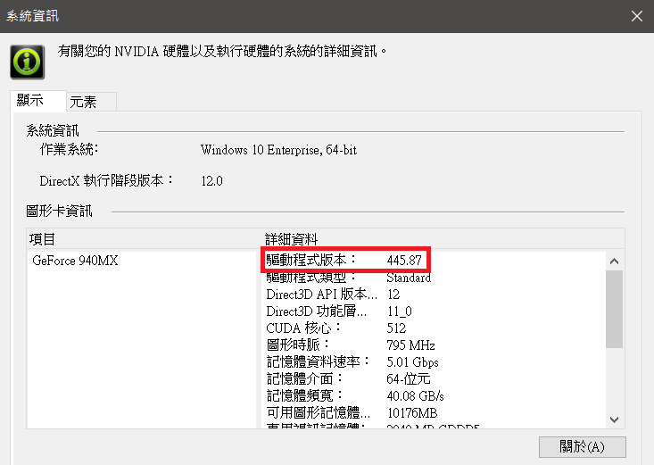
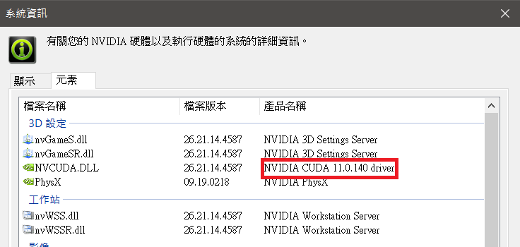
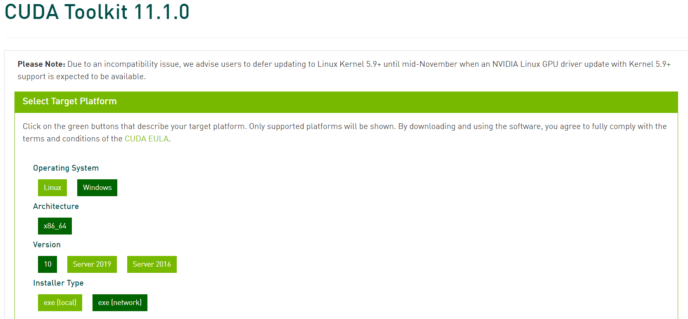
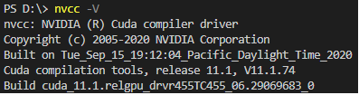
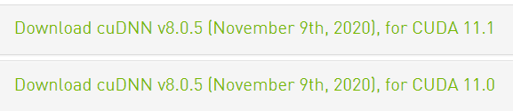
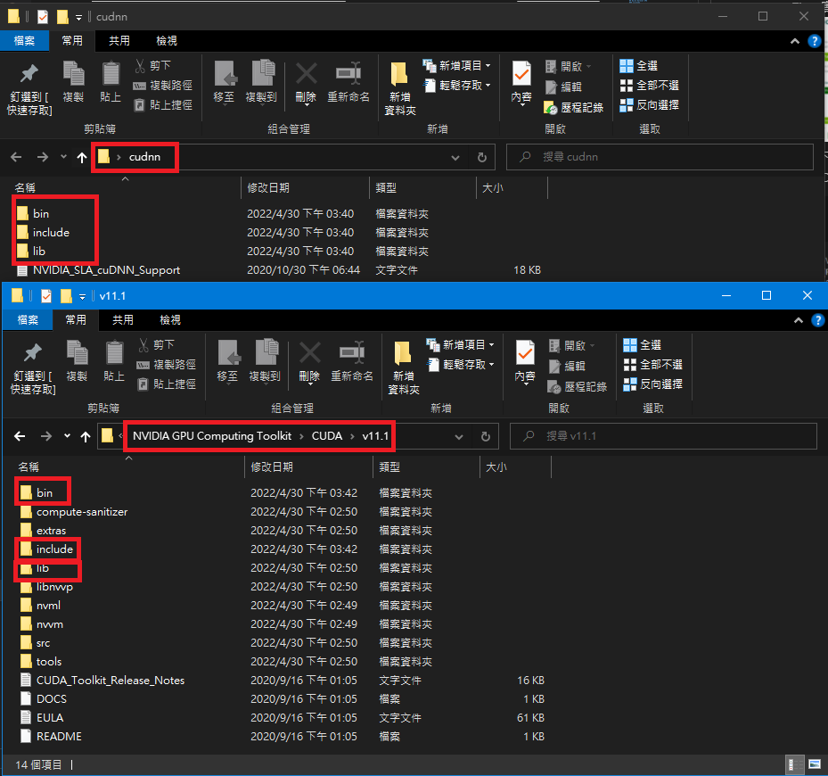

# Build YoloV4

## Download Darknet, OPenCV C++ & Visual studio 2019
Refer: https://github.com/AlexeyAB/darknet#requirements-for-windows-linux-and-macos

- Clone (上面的網址) darknet 專案
- Download OpenCV c++版本 (https://sourceforge.net/projects/opencvlibrary/)
- 將下載好的 OpenCV c++ 搬到 C槽，所以應該在c槽能看到 C:/opencv/build
- 新增系統環境變量: OpenCV_DIR = C:/opencv/build (不會可以跳過)
- Download and install VS2019 (https://docs.microsoft.com/zh-tw/visualstudio/releases/2019/release-notes )

## Build Darknet non GPU
- 用 VS2019打開 darknet/build/darknet/darknet_no_gpu.sln
- In VS2019 Configuration 改成 Release x64
- In VS2019 修改專案屬性(右邊欄，右鍵點選專案darknet_no_gpu)
- In VS2019 property, select Linker/General/Additional Library Directories, 修改OpenCV路徑 (C:/opencv/build )
- In VS2019 property, select C/C++/General/Additional Include Directories, 修改OpenCV路徑 (C:/opencv/build )
- 按確定，一樣右鍵專案選Build，build完成可在darknet/build/darknet/x64 找到darknet.exe

## Build Darknet GPU
### 安裝Cuda
- 查看電腦的 NVIDIA 版本是否支援 CUDA 以及能夠配置的 CUDA 版本
 <br>

- 查看顯卡的驅動程式與 CUDA 的版本對應 (https://docs.nvidia.com/cuda/cuda-toolkit-release-notes/index.html ) ，視情況更新顯示卡驅動 (https://www.nvidia.com/Download/index.aspx )
- 安裝 CUDA (https://developer.nvidia.com/cuda-toolkit-archive ) <br>
Tips: 實測過發現darknet windows 只支援 CUDA Toolkit 11.1.x

- 執行下載的CUDA Toolkit 11.1.x，直接默認安裝到底即可
- 測試 CUDA 是否安裝成功 <br>
  ```shell script
  nvcc -V
  ```
  

### 安裝cudnn
- 下載跟 CUDA 版本一樣的 cuDNN (https://developer.nvidia.com/rdp/cudnn-archive )<br>

- 下載完後解壓縮，確認壓縮檔內的資訊應有三個資料夾，分別是 **include**, **bin** and **lib**
- 將上述三個資料夾的內容，全數複製貼上至CUDA Toolkit 11.1.x的對應資料夾，如下圖


### 編譯Darknet
- windows 8 sdk download (https://developer.microsoft.com/en-us/windows/downloads/sdk-archive/ ) <br>
- 用 VS2019打開 darknet/build/darknet/darknet.sln
- In VS2019 Configuration 改成 Release x64
- In VS2019 修改專案屬性(右邊欄，右鍵點選專案darknet)
- In VS2019 property, select Linker/General/Additional Library Directories, 修改路徑: OpenCV, CUDA, cudnn
- In VS2019 property, select C/C++/General/Additional Include Directories, 修改修改路徑: OpenCV, CUDA, cudnn
- 按確定，一樣右鍵專案選Build，build完成可在darknet/build/darknet/x64 找到darknet.exe