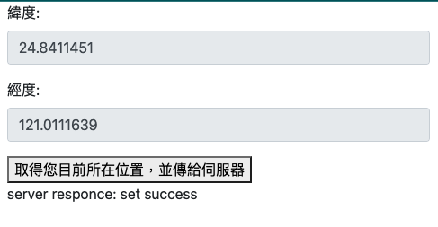
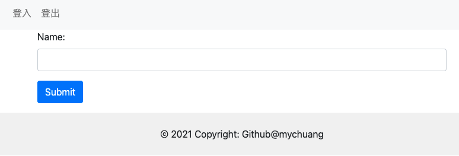

# Flask Project in RaspberryPi

## Flask Beginner
see the note folder as the following:
1. 建立第一個app
2. 透過url傳值&重導向
3. 樣板的渲染
4. POST
5. POST & 重導向
6. POST & AJAX 交互

## Samall Project
1. Location: 使用JS傳送經緯度給Server

     

2. Login: 使用Session記憶登入資訊
    
     
